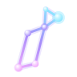

import { Meta } from '@storybook/addon-docs/blocks';
import './landing.css';

<Meta title="Introduction" />

  <section className="lyra-landing__hero">
    

      
Lit 3 · native custom elements · MIT licensed

      <h1>Complex interfaces, made lighter.</h1>
      

        Lyra UI is a clean, accessible component library for the parts of a product that usually
        take the most care: forms, dashboards, data visualization, and conversation experiences.
        Bring your own framework, keep your own design language, and start with a thoughtful
        primitive.
      

      

        <a className="lyra-landing__button lyra-landing__button--primary" href="?path=/docs/input--docs">
          Browse the library ↗
        </a>
        <a className="lyra-landing__button" href="#quick-start">
          Read the quick start ↓
        </a>
      

      

        
<strong>222</strong>custom elements

        
<strong>0</strong>framework lock-in

        
<strong>∞</strong>theme possibilities

      

    

    

      

        Ready to compose
        <i></i><i></i><i></i>
      

      

        
      

      

        One visual language
        Across every surface
      

    

  </section>

  <section className="lyra-landing__section lyra-landing__section--quick-start" id="quick-start">
    

      

        
A few lines to get moving

        <h2>Start with a component, not a setup.</h2>
      

      
Import only what you need, or register the full library while you explore.

    

    

      

        
◆ npm install

        <pre><code>npm install @aceshooting/lyra-ui</code></pre>
        
◆ use it anywhere

        <pre><code>import '@aceshooting/lyra-ui/components/button/button.js';</code></pre>
      

      

        
01
<strong>Pick a primitive</strong>Inputs, buttons, overlays, cards, charts, and more are independently importable.

        
02
<strong>Shape the surface</strong>Override semantic <code>--lyra-theme-*</code> tokens at any ancestor.

        
03
<strong>Ship with confidence</strong>Accessibility, RTL, localization, and reduced motion are part of the baseline.

      

    

  </section>

  <section className="lyra-landing__section">
    

      

        
Find your bearings

        <h2>Browse by the work in front of you.</h2>
      

      
Start with a primitive, browse a complete interaction, or borrow a pattern for your next product surface.

    

    

      <a className="lyra-landing__card lyra-landing__card--cyan" href="?path=/docs/input--docs">
        ⌁
        <strong>Build a form</strong>
        Inputs, selects, comboboxes, date pickers, validation, and native form behavior.
      </a>
      <a className="lyra-landing__card lyra-landing__card--violet" href="?path=/docs/chatmessage--docs">
        ✦
        <strong>Shape an agent surface</strong>
        Chat messages, streaming states, tool calls, approvals, citations, and model controls.
      </a>
      <a className="lyra-landing__card lyra-landing__card--pink" href="?path=/docs/charts-chart--docs">
        ◌
        <strong>Tell a data story</strong>
        Charts, tables, graphs, heatmaps, metrics, and empty states for information-rich products.
      </a>
    

  </section>

  <section className="lyra-landing__section">
    

      

        
The details are the product

        <h2>Designed for the edges.</h2>
      

      
Use the toolbar to preview light, dark, high-contrast, LTR, RTL, and compact layouts while you explore.

    

    

      
A<strong>Accessible by default</strong>Semantic descendants, keyboard behavior, focus management, and axe-tested stories.

      
B<strong>Themeable by design</strong>Semantic Lyra tokens let a whole product change character from one ancestor.

      
C<strong>Ready to compose</strong>Small primitives and ambitious surfaces share the same visual language.

    

  </section>

  <footer className="lyra-landing__footer">
    Open source, independent, and built for the web platform.
    <a href="https://github.com/aceshooting/lyra-ui">GitHub</a> · <a href="https://www.npmjs.com/package/@aceshooting/lyra-ui">npm</a> · <a href="./llms-full.txt">API reference</a>
  </footer>

