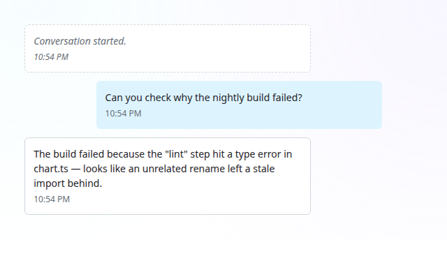
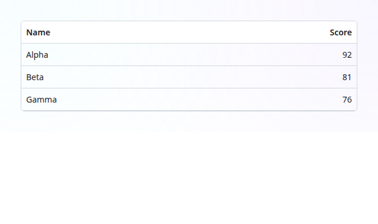
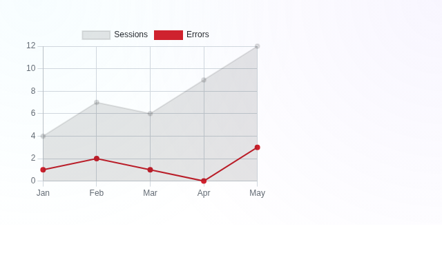

# Lyra UI (monorepo)

[](https://www.npmjs.com/package/@aceshooting/lyra-ui)
[](https://www.npmjs.com/package/@aceshooting/lyra-ui)
[](https://bundlephobia.com/package/@aceshooting/lyra-ui)
[](https://www.npmjs.com/package/@aceshooting/lyra-ui)
[](./LICENSE)
[](https://github.com/aceshooting/lyra-ui/actions/workflows/ci.yml)
[](https://github.com/aceshooting/lyra-ui/actions/workflows/codeql.yml)
[](https://scorecard.dev/viewer/?uri=github.com/aceshooting/lyra-ui)
[](https://www.bestpractices.dev/projects/13648)
[](https://www.lyra-ui.com/)
[](https://aceshooting.github.io/lyra-ui/)

<p align="center">
  <a href="https://www.lyra-ui.com/">
    
  </a>
</p>

A pnpm workspace hosting `lyra-ui` and its optional companion packages.

**[Browse the live docs site →](https://aceshooting.github.io/lyra-ui/)** — every component with
a live example, source code, and API reference.

<p align="center">
  <a href="https://aceshooting.github.io/lyra-ui/"></a>
  <a href="https://aceshooting.github.io/lyra-ui/"></a>
  <a href="https://aceshooting.github.io/lyra-ui/"></a>
</p>
<p align="center"><sub>A few of 170 components — <a href="https://aceshooting.github.io/lyra-ui/">browse them all live →</a></sub></p>

## Table of Contents

- [Quick Start](#quick-start)
- [Principles & Guidelines](#principles--guidelines)
- [Components](#components)
- [Theming, internationalization & RTL](#theming-internationalization--rtl)
- [Framework integration](#framework-integration-react-vue-angular-svelte)
- [SSR & Declarative Shadow DOM](#ssr--declarative-shadow-dom)
- [Browser & Node support](#browser--node-support)
- [Built with](#built-with)
- [Documentation](#documentation)
- [Claude Code plugin](#claude-code-plugin)
- [Status](#status)
- [License](#license)

**Lyra UI is a free, independent alternative to Shoelace and Web Awesome.** It is a MIT-licensed,
framework-agnostic Lit web-component library for production interfaces: accessible form controls,
navigation, overlays, dashboards, data visualization, file workflows, and a complete conversation
and agent UI toolkit for chat products. It runs on native custom elements, has no runtime dependency
on Shoelace or Web Awesome, and ships with its own design tokens, localization runtime, RTL support,
reduced-motion behavior, and form-associated controls.

Lyra also makes migration practical. Selected components expose a documented Web Awesome-compatible
surface under the `lyra-` prefix, so many `wa-*` integrations can move through a mechanical tag-name
and import change, with intentional differences documented per component. Shoelace users get a
clear `sl-*` → `lyra-*` component map and migration notes; Lyra is an independent implementation,
not a fork, rebrand, official product, or affiliated project. No Web Awesome Pro source code was
available to or used by the maintainers.

The result is one open library for everyday UI, dashboards and charts, and AI chat/agent interfaces —
with the broad component coverage of a general-purpose design system and original building blocks
for data-heavy and streaming applications.

| Package | Description | Version | Size |
|---|---|---|---|
| [`packages/lyra-ui`](./packages/lyra-ui) | Free, independent Lit web components — an alternative to Shoelace and Web Awesome. | [](https://www.npmjs.com/package/@aceshooting/lyra-ui) | [](https://bundlephobia.com/package/@aceshooting/lyra-ui) |
| [`packages/lyra-flags`](./packages/lyra-flags) | Optional waving flag SVGs for `<lyra-flag>`, kept out of `lyra-ui`'s install by default. | [](https://www.npmjs.com/package/@aceshooting/lyra-flags) | *n/a — SVG assets, not a JS bundle* |

See each package's own README for full install/usage details.

## Quick Start

```bash
npm install @aceshooting/lyra-ui
```

```js
import '@aceshooting/lyra-ui/components/combobox/combobox.js';
import '@aceshooting/lyra-ui/components/combobox/option.js';
```

```html
<lyra-combobox label="Fruit" with-clear>
  <lyra-option value="a">Apple</lyra-option>
  <lyra-option value="b">Banana</lyra-option>
</lyra-combobox>
```

Per-component optional peers and the tree-shakeable import patterns:
[`packages/lyra-ui/README.md#install`](./packages/lyra-ui/README.md#install).

🔗 **[Open in StackBlitz](https://stackblitz.com/github/aceshooting/lyra-ui)** — try it in-browser, no local install.

For local development of this monorepo:

```bash
pnpm install
pnpm build        # builds every package
pnpm test         # tests every package
pnpm lint         # typechecks every package
pnpm docs         # Storybook docs site demoing every component
```

Contributors and AI coding agents working on this repo: see [AGENTS.md](./AGENTS.md).

## Principles & Guidelines

| Principle | Description |
|---|---|
| 🆓 Free & Open Source | MIT-licensed and free — nothing hidden inside |
| 🪶 Lightweight & Tree-Shakeable | Import only what you use — no dead weight |
| ⚡ Performance-First | Native custom elements, no virtual DOM, minimal deps |
| 🤖 AI & Agentic-AI Ready | Machine-readable docs and manifests AI agents use correctly |
| 🧩 Consistent Architecture | One shared base — learn one component, know them all |
| 🎨 Design Tokens Only | Every value is a `--lyra-*` token — restyle from one place |
| 🌍 i18n & RTL by Default | Every string translatable, every layout mirrors RTL |
| ♿ Accessibility First | Correct ARIA in shadow DOM, automated a11y checks |
| 📐 Responsive by Allocation | Adapts to its container, not just the viewport |
| 🎬 Motion-Aware | Themeable timing, honors `prefers-reduced-motion` |
| 🔗 Synchronized Public API | Docs, tests, and manifest always match the code |
| 🔒 Responsible Disclosure | Private reporting, 90-day coordinated disclosure |

## Components

222 custom elements across five component families. Every tag has a live, interactive example on the
[docs site](https://aceshooting.github.io/lyra-ui/); for the full per-tag reference (Web Awesome
mirror, props, events, slots, parts) see
[`packages/lyra-ui/README.md#components`](./packages/lyra-ui/README.md#components).

| Family | Highlights |
|---|---|
| Form controls and input workflows | combobox, select, date picker/input, calendar, textarea, input, button, phone input, file input, token input, color/radio/checkbox/switch/slider controls and checkbox group, toast, and sparkline |
| Dashboard and data visualization | stat card, sortable table, data grid, pagination, gauge, export/copy actions, split panes, widgets, word cloud, time range, playback, heatmap, tree, graph, and Chart.js or dependency-free charts |
| Layout, navigation, and overlays | tabs, menus, command palette, breadcrumbs, details/accordion, dialog, drawer, carousel, popover, tooltip, dropdown, scroller, resize/observer utilities, and responsive panels |
| Conversation and Agent UI | chat messages and composer, streaming text, citations, sources, tool-call/result/approval flows, model selection, document/media previews, and more |
| Display and utility primitives | badges, tags, icons and icon buttons, callouts, cards, avatars, skeletons, progress, spinners, rating, formatting, markdown, code blocks and a code editor, JSON, and live-region helpers |

## Theming, internationalization & RTL

Every one of the 222 tags is built on the same three guarantees — not opt-in per component:

- **Theming** through `--lyra-*` design tokens — retheme by overriding a custom property,
  no per-component theming API to learn.
- **Internationalization** via a small runtime (`registerLyraLocale`/`setLyraLocale`, or a
  per-instance `.strings` override) — every built-in string (labels, announcements, aria-labels)
  is translatable without a rebuild or a per-locale bundle.
- **RTL** with zero per-component opt-in — set `dir="rtl"` (or an RTL `lang`) anywhere up the tree
  and every component mirrors its layout and keyboard navigation to match.

See [`packages/lyra-ui/README.md#theming-internationalization--rtl`](./packages/lyra-ui/README.md#theming-internationalization--rtl)
for the full usage details.

## Framework integration (React, Vue, Angular, Svelte)

Lyra ships plain custom elements — no framework-specific wrapper package needed.

```jsx
// React 19+
import '@aceshooting/lyra-ui/components/combobox/combobox.js';

<lyra-combobox label="Fruit" with-clear>
  <lyra-option value="a">Apple</lyra-option>
</lyra-combobox>
```

```vue
<!-- Vue -->
<lyra-combobox label="Fruit" @lyra-change="onChange" />
```

```html
<!-- Angular — module/component needs schemas: [CUSTOM_ELEMENTS_SCHEMA] -->
<lyra-combobox label="Fruit" (lyra-change)="onChange($event)"></lyra-combobox>
```

```svelte
<!-- Svelte -->
<lyra-combobox label="Fruit" on:lyra-change={onChange} />
```

Property-vs-attribute binding, Angular's `CUSTOM_ELEMENTS_SCHEMA`, and event-name casing notes:
[`packages/lyra-ui/README.md#framework-integration-vue-angular-svelte`](./packages/lyra-ui/README.md#framework-integration-vue-angular-svelte).

## SSR & Declarative Shadow DOM

Lyra components are standard Lit 3 custom elements: they render through `@lit-labs/ssr` into
Declarative Shadow DOM in principle, and a spot check of `<lyra-button>` confirms basic
server-rendering works — but the library has not been systematically tested or tuned for SSR at
scale. See
[`packages/lyra-ui/README.md#ssr--declarative-shadow-dom`](./packages/lyra-ui/README.md#ssr--declarative-shadow-dom)
for details.

## Browser & Node support

- **Node** ≥ 20 to build/test this repo (`engines.node`); the published packages have no Node
  runtime dependency — they run in the browser.
- **Browsers** — any evergreen browser with Custom Elements v1 + Shadow DOM support (Chrome, Edge,
  Firefox, Safari). CI runs the full test suite against Chromium plus a separate platform-contract
  suite against Firefox and WebKit, on Node 20 and 22.
- Not tested against Internet Explorer or other browsers without native custom-element support.

## Built with

- [Lit 3](https://lit.dev) — the web-component base every Lyra element extends
- [Floating UI](https://floating-ui.com) — positioning engine for popovers, tooltips, dropdowns, and the combobox menu
- [Chart.js](https://www.chartjs.org) & [D3](https://d3js.org) — optional peers powering the Chart.js chart family and `<lyra-graph>`
- [Storybook](https://storybook.js.org) — the live docs site and component workshop
- [Noto Emoji](https://github.com/googlefonts/noto-emoji) flag artwork — vendored into `@aceshooting/lyra-flags` (Public Domain)

## Documentation

- **Humans:** the [live docs site](https://aceshooting.github.io/lyra-ui/) (Storybook — every
  component's canvas, source, and props/events/slots reference).
- **AI agents integrating this library:** [`packages/lyra-ui/llms.txt`](./packages/lyra-ui/llms.txt)
  (short index) and [`llms-full.txt`](./packages/lyra-ui/llms-full.txt) (full API reference).
- **Contributors working on this repo itself:** [`AGENTS.md`](./AGENTS.md) (AI agents) and
  [`CONTRIBUTING.md`](./CONTRIBUTING.md) (humans).

## Claude Code plugin

`@aceshooting/lyra-ui` ships a [Claude Code](https://claude.com/claude-code) plugin so Claude gets
the exact component API (not a guess from training data) while working in a project that depends
on this library, plus commands for migrating off Web Awesome/Shoelace and auditing lyra-ui usage.

```bash
# Via Claude Code's plugin marketplace
/plugin marketplace add aceshooting/lyra-ui
/plugin install lyra-ui@aceshooting
```

Prefer a standalone download (e.g. for claude.ai Skills, outside Claude Code's plugin system)?
Grab [`skills/lyra-ui.skill`](./skills/lyra-ui.skill) directly from this repo.

See [`plugins/lyra-ui`](./plugins/lyra-ui) for the plugin source, or
[`packages/lyra-ui/llms.txt`](./packages/lyra-ui/llms.txt) for the same component reference
without Claude Code.

## Status

`@aceshooting/lyra-ui` is published at `3.7.0`; `@aceshooting/lyra-flags` at `1.3.0` — see each
package's own `CHANGELOG.md` for release history. The two are versioned independently (not always
lockstep) with [Changesets](https://github.com/changesets/changesets) and follow semver: a major
bump signals a breaking change, everything else is additive or a fix. Every release passes the same
CI gate as every PR (install, lint, test, build, manifest — see the badge above), and both packages
are under active development, with new components and fixes shipping regularly.

## License

[MIT](./LICENSE) for the code. `packages/lyra-flags` ships third-party flag artwork vendored
from Google's Noto Emoji project (Public Domain / copyright-exempt) — see
[its README](./packages/lyra-flags/README.md#asset-provenance--license) for the sourcing
details and upstream license text.

---

<p align="center">A UI library built with ❤️ by AI, for AI.</p>
