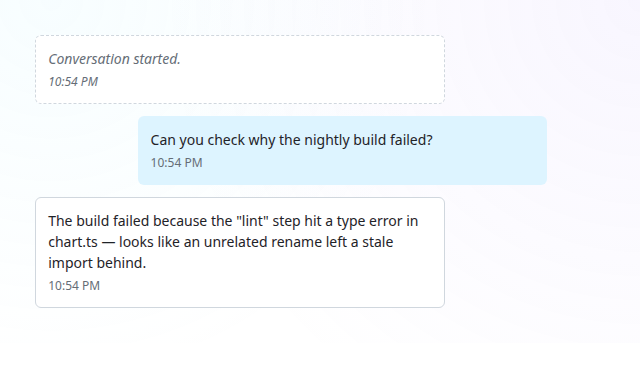
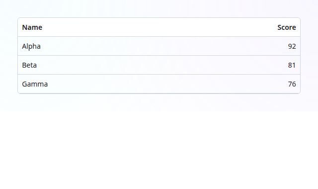
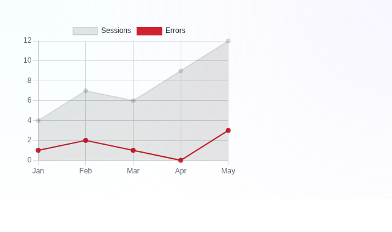

# Lyra UI: UI, made light 🪶 ✨

[](https://github.com/aceshooting/lyra-ui/actions/workflows/ci.yml)
[](https://codecov.io/gh/aceshooting/lyra-ui)
[](https://github.com/aceshooting/lyra-ui/actions/workflows/codeql.yml)
[](https://scorecard.dev/viewer/?uri=github.com/aceshooting/lyra-ui)
[](https://www.bestpractices.dev/projects/13648)
[](https://aceshooting.github.io/lyra-ui/)
[](https://www.lyra-ui.com/)
[](https://www.npmjs.com/package/@aceshooting/lyra-ui)
[](https://www.npmjs.com/package/@aceshooting/lyra-ui)
[](https://www.npmjs.com/package/@aceshooting/lyra-ui)
[](https://www.npmjs.com/package/@aceshooting/lyra-ui)
[](https://lit.dev/)
[](https://www.webcomponents.org/)
[](https://github.com/aceshooting/lyra-ui/blob/main/packages/lyra-ui/scripts/bundle-stats.json)
[](https://github.com/aceshooting/lyra-ui/blob/main/packages/lyra-ui/scripts/bundle-stats.json)
[](https://www.npmjs.com/package/@aceshooting/lyra-ui)
[](./LICENSE)

Tested on every modern engine — see [Browser & Node support](#browser--node-support) for what CI
actually proves for each:

[](https://github.com/aceshooting/lyra-ui/actions/workflows/test-all-browsers.yml)
[](https://github.com/aceshooting/lyra-ui/actions/workflows/full-engine.yml)
[](https://github.com/aceshooting/lyra-ui/actions/workflows/full-engine.yml)
[](https://github.com/aceshooting/lyra-ui/actions/workflows/test-all-browsers.yml)
[](https://github.com/aceshooting/lyra-ui/actions/workflows/ci.yml)

<p align="center">
  <a href="https://www.lyra-ui.com/">
    
  </a>
</p>

A pnpm workspace hosting `lyra-ui` and its optional companion packages.

**[Browse the live docs site →](https://aceshooting.github.io/lyra-ui/)** — every component with
a live example, source code, and API reference.

<p align="center">
  <a href="https://aceshooting.github.io/lyra-ui/"></a>
  <a href="https://aceshooting.github.io/lyra-ui/"></a>
  <a href="https://aceshooting.github.io/lyra-ui/"></a>
</p>
<p align="center"><sub>A few of 284 custom elements — <a href="https://aceshooting.github.io/lyra-ui/">browse them all live →</a></sub></p>

## Table of Contents

- [Quick Start](#quick-start)
- [Upgrading from 7.x](#upgrading-from-7x)
- [Principles & Guidelines](#principles--guidelines)
- [Components](#components)
- [Theming, internationalization & RTL](#theming-internationalization--rtl)
- [Framework integration](#framework-integration-react-vue-angular-svelte)
- [SSR & Declarative Shadow DOM](#ssr--declarative-shadow-dom)
- [Browser & Node support](#browser--node-support)
- [Built with](#built-with)
- [Documentation](#documentation)
- [Codex and Claude Code plugin](#codex-and-claude-code-plugin)
- [Status](#status)
- [License](#license)

**Lyra UI is a free, independent alternative to Shoelace and Web Awesome.** It is a MIT-licensed,
framework-agnostic Lit web-component library for production interfaces: accessible form controls,
navigation, overlays, dashboards, data visualization, file workflows, and a complete conversation
and agent UI toolkit for chat products. It runs on native custom elements, has no runtime dependency
on Shoelace or Web Awesome, and ships with its own design tokens, localization runtime, RTL support,
reduced-motion behavior, and form-associated controls.

Lyra also makes migration practical. Selected components expose a documented Web Awesome-compatible
surface under the `lr-` prefix, so many `wa-*` integrations can move through a mechanical tag-name
and import change, with intentional differences documented per component. Shoelace users get a
clear `sl-*` → `lr-*` component map and migration notes; Lyra is an independent implementation,
not a fork, rebrand, official product, or affiliated project. No Web Awesome Pro source code was
available to or used by the maintainers.

The result is one open library for everyday UI, dashboards and charts, and AI chat/agent interfaces —
with the broad component coverage of a general-purpose design system and original building blocks
for data-heavy and streaming applications.

| Package | Description | Version | Size |
|---|---|---|---|
| [`packages/lyra-ui`](./packages/lyra-ui) | Free, independent Lit web components — an alternative to Shoelace and Web Awesome. | [](https://www.npmjs.com/package/@aceshooting/lyra-ui) | [](https://github.com/aceshooting/lyra-ui/blob/main/packages/lyra-ui/scripts/bundle-stats.json) [](https://github.com/aceshooting/lyra-ui/blob/main/packages/lyra-ui/scripts/bundle-stats.json) |
| [`packages/lyra-flags`](./packages/lyra-flags) | Optional waving flag SVGs for `<lr-flag>`, kept out of `lyra-ui`'s install by default. | [](https://www.npmjs.com/package/@aceshooting/lyra-flags) | *n/a — SVG assets, not a JS bundle* |

See each package's own README for full install/usage details.

## Quick Start

```bash
npm install @aceshooting/lyra-ui
```

```js
import '@aceshooting/lyra-ui/components/forms/combobox/combobox.js';
import '@aceshooting/lyra-ui/components/forms/combobox/option.js';
```

```html
<lr-combobox label="Fruit" clearable>
  <lr-option value="a">Apple</lr-option>
  <lr-option value="b">Banana</lr-option>
</lr-combobox>
```

Per-component optional peers and the tree-shakeable import patterns:
[`packages/lyra-ui/README.md#install`](./packages/lyra-ui/README.md#install).
For arbitrary server/CMS markup, the optional guarded loader discovers only rendered tags and has a
separate ESM-CDN auto-start entry:
[`packages/lyra-ui/README.md#optional-autoloader-and-cdn-entry`](./packages/lyra-ui/README.md#optional-autoloader-and-cdn-entry).

🔗 **[Open in StackBlitz](https://stackblitz.com/github/aceshooting/lyra-ui)** — try it in-browser, no local install.

For local development of this monorepo:

```bash
pnpm install
pnpm build        # builds every package
pnpm test         # tests every package
pnpm lint         # contract-policy, source checks, TypeScript, and type-surface tests
pnpm docs         # Storybook docs site demoing every component
pnpm run migrate-wa --help  # print migration tool usage
pnpm run test:migrate-wa     # run migration fixture/tests
```

Contributors and AI coding agents working on this repo: see [AGENTS.md](./AGENTS.md).

## Upgrading from 7.x

8.0.0 aligns the mapped component contracts, preserves displaced Lyra behavior under truthful new
tags, and adds the Page, Video, Playlist, SSR, typing, and optional loading/style surfaces needed for
a complete migration. It also includes intentional tag, attribute, default, and styling-vocabulary
changes. The full list, with what each one changes and what to search for, is in the package README:
[`packages/lyra-ui/README.md#upgrading-from-7x`](./packages/lyra-ui/README.md#upgrading-from-7x).

## Principles & Guidelines

| Principle | Description |
|---|---|
| 🆓 Free & Open Source | MIT-licensed and free — nothing hidden inside |
| 🪶 Lightweight & Tree-Shakeable | Import only what you use — no dead weight |
| ⚡ Performance-First | Native custom elements, no virtual DOM, minimal deps |
| 🤖 AI & Agentic-AI Ready | Machine-readable docs and manifests AI agents use correctly |
| 🧩 Consistent Architecture | One shared base — learn one component, know them all |
| 🎨 Design Tokens Only | Every value is a `--lr-*` token — restyle from one place |
| 🌍 i18n & RTL by Default | Every string translatable, every layout mirrors RTL |
| ♿ Accessibility First | Correct ARIA in shadow DOM, automated a11y checks |
| 📐 Responsive by Allocation | Adapts to its container, not just the viewport |
| 🎬 Motion-Aware | Themeable timing, honors `prefers-reduced-motion` |
| 🔗 Synchronized Public API | Docs, tests, and manifest always match the code |
| 🔒 Responsible Disclosure | Private reporting, 90-day coordinated disclosure |

## Components

284 custom elements across eleven component families. Every tag has a live, interactive example on the
[docs site](https://aceshooting.github.io/lyra-ui/); for the full per-tag reference (Web Awesome
mirror, props, events, slots, parts) see
[`packages/lyra-ui/README.md#components`](./packages/lyra-ui/README.md#components).

Use the stable tag alias `@aceshooting/lyra-ui/components/lr-<name>.js` to register one element;
the alias stays valid if the component's internal family changes. Import
`@aceshooting/lyra-ui/components/<family>` to register a whole family at once.

| Family | Highlights |
|---|---|
| `forms` | button, input, textarea, select, combobox, date picker, calendar, phone/token/file input, color and swatch pickers, emoji picker, locale picker, code editor, checkbox/radio/switch/slider, time range, rubric form |
| `layout` | page, tabs, menu, command palette, breadcrumb, details, card, widget, split, stepper, carousel, scroller, app rail, dock panel, dashboard grid, drilldown panel, filter bar, segmented, virtual list, responsive panel |
| `overlays` | dialog, drawer, overlay, toast, callout, badge, chip, kbd, rating, progress, spinner, skeleton, empty |
| `data` | table, data grid, tree, timeline, calendar, gauge, heatmap, sparkline, word cloud, stat, pagination, query builder, flow canvas and nodes, sequence strip, file tree, env list, context meter |
| `charts` | Chart.js-backed `lr-chart` (optional peer) |
| `conversation` | chat message, composer and viewport, structured message parts, prompt input and queue, streaming text, markdown, code block, model select, realtime session, selection toolbar, thinking panel, branch picker, checkpoint, message actions and feedback, push-to-talk, audio visualizer, thread list |
| `agent-tools` | agent run and trace, subagent panel, MCP app, prompt studio, schema viewer, tool call chip, tool approval dialog and approval queue, task list, terminal, span waterfall, stack trace, test results, activity feed, context inspector, artifact panel, commit card, eval dataset/run/result, evaluation dashboard, policy summary |
| `retrieval` | retrieval search and results, retrieval comparison, grounded RAG answer, claim evidence, grounding summary, RAG evaluation dashboard, citation badge, chunk inspector, knowledge base and admin, ingestion queue, knowledge-graph explorer, graph, mind map, embedding explorer, entity card/chip/dossier, provenance panel, memory panel, neighbor list, path strip |
| `viewers` | document, PDF, DOCX, PPTX, spreadsheet, CSV, notebook, ebook, email, calendar, contact, archive, XML, SVG, HTML and GeoJSON viewers, document compare and preview, dataset viewer, highlight layer, page rail |
| `media` | video and video playlist, image viewer and comparer, lightbox, sandboxed zoomable frame, pan/zoom, AV player, playback, animated image, avatar and avatar group, file icon, file input, attachment chip, map, QR code, flag |
| `utility` | icon, format, copy and export buttons, diff view, JSON viewer, divider, live region, mention popover, tour, poll status, known date, resize/intersection/mutation observers |

## Theming, internationalization & RTL

Every one of the 284 tags is built on the same three guarantees — not opt-in per component:

- **Theming** through `--lr-*` design tokens — retheme by overriding a custom property,
  no per-component theming API to learn.
- **Internationalization** via a small runtime (`registerLyraLocale`/`setLyraLocale`, or a
  per-instance `.strings` override) — every built-in string (labels, announcements, aria-labels)
  is translatable without a rebuild or a per-locale bundle.
- **RTL** with zero per-component opt-in — set `dir="rtl"` anywhere up the tree and every component
  mirrors its layout and keyboard navigation to match. `lang` selects locale data; it does not
  silently change writing direction.

See [`packages/lyra-ui/README.md#theming-internationalization--rtl`](./packages/lyra-ui/README.md#theming-internationalization--rtl)
for the full usage details.

## Framework integration (React, Vue, Angular, Svelte)

Lyra ships plain custom elements — no framework-specific wrapper package needed.

```tsx
// React 19+
import '@aceshooting/lyra-ui/components/forms/combobox/combobox.js';
import '@aceshooting/lyra-ui/components/forms/combobox/option.js';
import type {} from '@aceshooting/lyra-ui/custom-elements-jsx';

<lr-combobox label="Fruit" clearable>
  <lr-option value="a">Apple</lr-option>
</lr-combobox>
```

```vue
<!-- Vue -->
<lr-combobox label="Fruit" @lr-change="onChange" />
```

```html
<!-- Angular — module/component needs schemas: [CUSTOM_ELEMENTS_SCHEMA] -->
<lr-combobox label="Fruit" (lr-change)="onChange($event)"></lr-combobox>
```

```svelte
<!-- Svelte -->
<lr-combobox label="Fruit" on:lr-change={onChange} />
```

React/JSX, Vue, and Svelte each have an opt-in, type-only declaration entry generated from the same
Custom Elements Manifest; they add template/ref/event/CSS-property types without a runtime wrapper
or tag registration. Property-vs-attribute binding, Angular's `CUSTOM_ELEMENTS_SCHEMA`, and
event-name casing notes:
[`packages/lyra-ui/README.md#framework-integration-react-vue-angular-svelte`](./packages/lyra-ui/README.md#framework-integration-react-vue-angular-svelte).
Complete React 19, Vue, and Svelte Vite applications live in
[`examples/frameworks/`](./examples/frameworks/); each is typechecked and production-built against
the packed package.

## SSR & Declarative Shadow DOM

Root and granular component imports are server-safe. Lyra ships a tested `@lit-labs/ssr` support
matrix: compatible components emit Declarative Shadow DOM and hydrate in place, while components
that need browser DOM during their first render use an explicit host-and-light-DOM fallback before
rendering on upgrade. Import `@aceshooting/lyra-ui/ssr-loader.js` before any other Lit module in the
browser. See
[`packages/lyra-ui/README.md#ssr--declarative-shadow-dom`](./packages/lyra-ui/README.md#ssr--declarative-shadow-dom)
for the renderer setup, machine-readable matrix, diagnostics, and capability limits.

## Browser & Node support

- **Node** ≥ 20 to build/test this repo and to run the supported SSR imports (`engines.node`);
  browser-only capabilities start after hydration.
- **Browsers** — any evergreen browser with Custom Elements v1 + Shadow DOM support (Chrome, Edge,
  Firefox, Safari). Every push runs the complete suite against Chromium plus a platform-contract
  suite (a curated fast subset) against Chrome, Edge, Firefox, and Safari (WebKit) on Node 20 and
  22. The two engines that only get the fast subset per-push (Firefox, Safari/WebKit) get the
  *complete* suite weekly and before every release via
  [`full-engine.yml`](https://github.com/aceshooting/lyra-ui/actions/workflows/full-engine.yml).
  [`test-all-browsers.yml`](https://github.com/aceshooting/lyra-ui/actions/workflows/test-all-browsers.yml)
  runs the complete suite against all five browsers (Chromium, Chrome, Edge, Firefox, Safari) on
  demand — the tool of record for "does everything actually pass everywhere right now."
- Not tested against Internet Explorer or other browsers without native custom-element support.
- **Exact version floors** (Chromium 120+, Gecko 121+, WebKit 16.4+), how they were derived, the CI
  matrix behind them, assistive-technology status, and the policy for engines outside the window:
  [`docs/support-policy.md`](./docs/support-policy.md).

## Built with

- [Lit 3](https://lit.dev) — the web-component base every Lyra element extends
- [Floating UI](https://floating-ui.com) — positioning engine for popovers, tooltips, dropdowns, and the combobox menu
- [Chart.js](https://www.chartjs.org) & [D3](https://d3js.org) — optional peers powering the Chart.js chart family and `<lr-graph>`
- [Storybook](https://storybook.js.org) — the live docs site and component workshop
- [Noto Emoji](https://github.com/googlefonts/noto-emoji) flag artwork — vendored into `@aceshooting/lyra-flags` (Public Domain)

## Documentation

- **Humans:** the [live docs site](https://aceshooting.github.io/lyra-ui/) (Storybook — every
  component's canvas, source, and props/events/slots reference).
- **AI agents integrating this library:** [`packages/lyra-ui/llms.txt`](./packages/lyra-ui/llms.txt)
  (short index) and [`llms-full.txt`](./packages/lyra-ui/llms-full.txt) (full API reference).
- **Contributors working on this repo itself:** [`AGENTS.md`](./AGENTS.md) (AI agents) and
  [`CONTRIBUTING.md`](./CONTRIBUTING.md) (humans).
- **Accessibility:** [`docs/accessibility.md`](./docs/accessibility.md) — which guarantees a gate
  enforces on every commit, which are conventions, and which are not verified at all (no screen
  reader has been run against this library).
- **Component qualification:** [`docs/component-quality.md`](./docs/component-quality.md) —
  per-tag automated evidence, explicit exemptions, human-review status, and known limitations.
- **Component integration:** [`docs/component-integration.md`](./docs/component-integration.md) —
  stable/class imports, optional peers, component dependencies, and measured or pending gzip data.
- **Support window:** [`docs/support-policy.md`](./docs/support-policy.md) — supported browser and
  Node versions, what CI actually proves for each, assistive-technology status, and the policy for
  engines outside the window.
- **Getting help:** [`SUPPORT.md`](./SUPPORT.md) — issue routes, required reproduction details, and
  the boundary between community support and private vulnerability reporting.
- **Governance and substantial changes:** [`GOVERNANCE.md`](./GOVERNANCE.md) and the
  [`docs/rfcs/`](./docs/rfcs/process.md) process — decision authority, RFC scope, lifecycle, and
  proposal template.

## Codex and Claude Code plugin

`@aceshooting/lyra-ui` ships a shared [Codex](https://learn.chatgpt.com/docs/plugins) and
[Claude Code](https://claude.com/claude-code) plugin so coding agents get the exact component API
(not a guess from training data) while working in a project that depends on this library, plus
workflows for migrating off Web Awesome/Shoelace and auditing lyra-ui usage.

```bash
# Via Codex CLI's plugin marketplace
codex plugin marketplace add aceshooting/lyra-ui
codex plugin add lyra-ui@aceshooting
```

```bash
# Via Claude Code's plugin marketplace
/plugin marketplace add aceshooting/lyra-ui
/plugin install lyra-ui@aceshooting
```

For a direct Codex skill install without the plugin:

```text
$skill-installer install https://github.com/aceshooting/lyra-ui/tree/main/plugins/lyra-ui/skills/lyra-ui
$skill-installer install https://github.com/aceshooting/lyra-ui/tree/main/plugins/lyra-ui/skills/compose-lyra-interfaces
```

Clients that accept standalone skill bundles can instead download
[`skills/lyra-ui.skill`](./skills/lyra-ui.skill) for exact API lookup or
[`skills/compose-lyra-interfaces.skill`](./skills/compose-lyra-interfaces.skill) for composition.

See [`plugins/lyra-ui`](./plugins/lyra-ui) for the plugin source, or
[`packages/lyra-ui/llms.txt`](./packages/lyra-ui/llms.txt) for the same component reference
without a plugin install. The plugin also includes `$compose-lyra-interfaces`, a focused workflow
for turning product intent into responsive, accessible Lyra component compositions while the
main `$lyra-ui` skill remains the exact API reference.

## Status

`@aceshooting/lyra-ui` source is versioned at `8.2.3`; `@aceshooting/lyra-flags` source at `2.0.0`
— see each package's own `CHANGELOG.md` for release history. Published npm versions can lag these
source versions while a release is being qualified. The two are versioned independently (not
always lockstep) with [Changesets](https://github.com/changesets/changesets) and follow semver.

Every component also carries machine-readable `stable` or `experimental` status plus its first
published `since` version. Both statuses receive normal semver protection once published;
experimental means the design is still under review, not that breaking changes can ship in a minor
release. A deprecation names its replacement, rationale, deprecation version, and earliest removal
version, and remains available for the entire following major release line. The full policy is in
[`packages/lyra-ui/llms/shared.md#component-status-versioning-and-deprecation`](./packages/lyra-ui/llms/shared.md#component-status-versioning-and-deprecation).
Every release passes the same CI gate as every PR, and both packages are under active development.

## License

[MIT](./LICENSE) for the code. `packages/lyra-flags` ships third-party flag artwork vendored
from Google's Noto Emoji project (Public Domain / copyright-exempt) — see
[its README](./packages/lyra-flags/README.md#asset-provenance--license) for the sourcing
details and upstream license text.

---

<p align="center">A UI library built with ❤️ by AI, for AI.</p>
